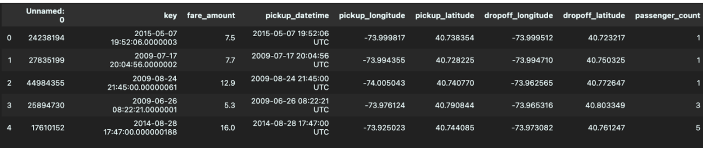
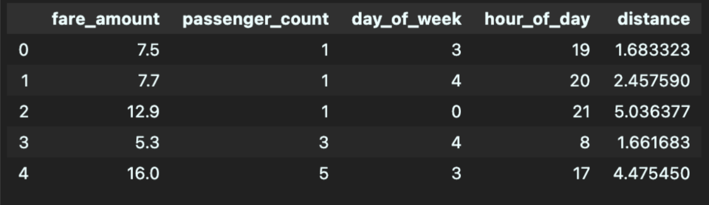
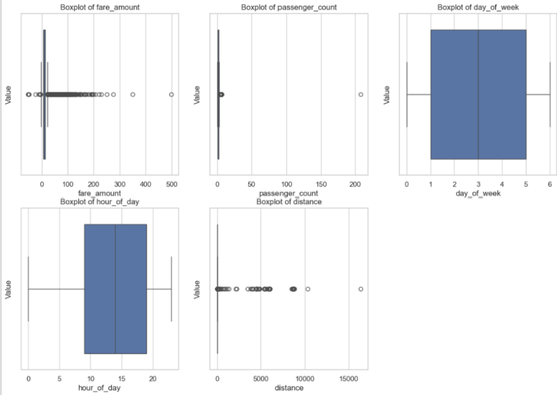
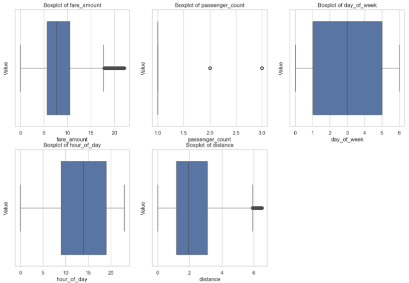
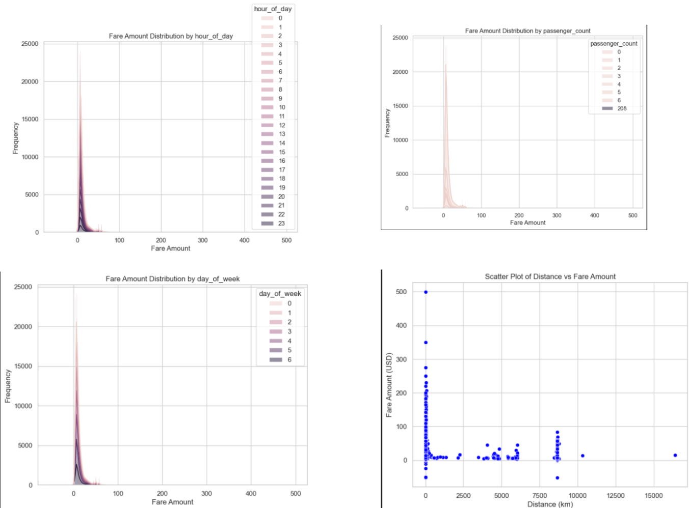
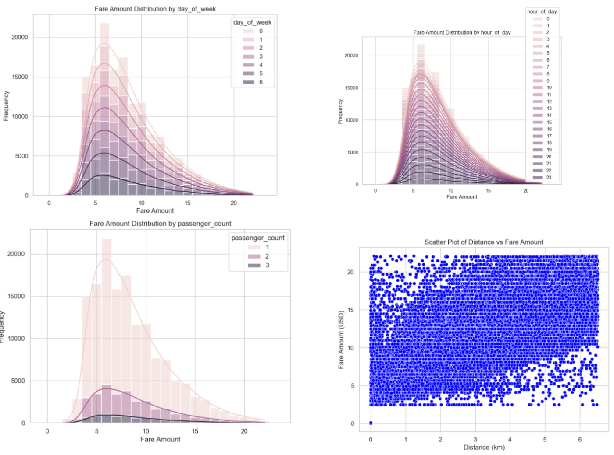
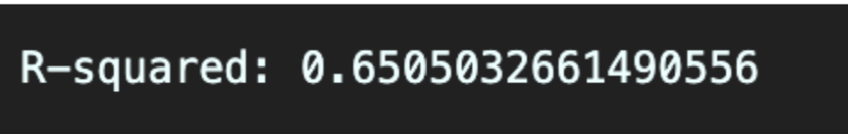
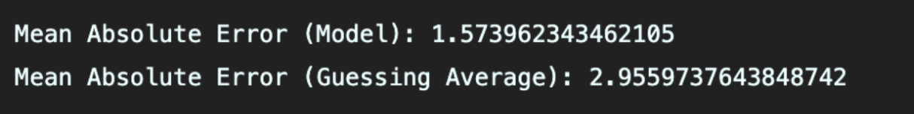
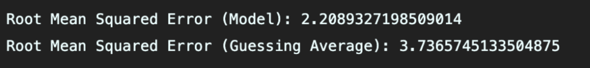
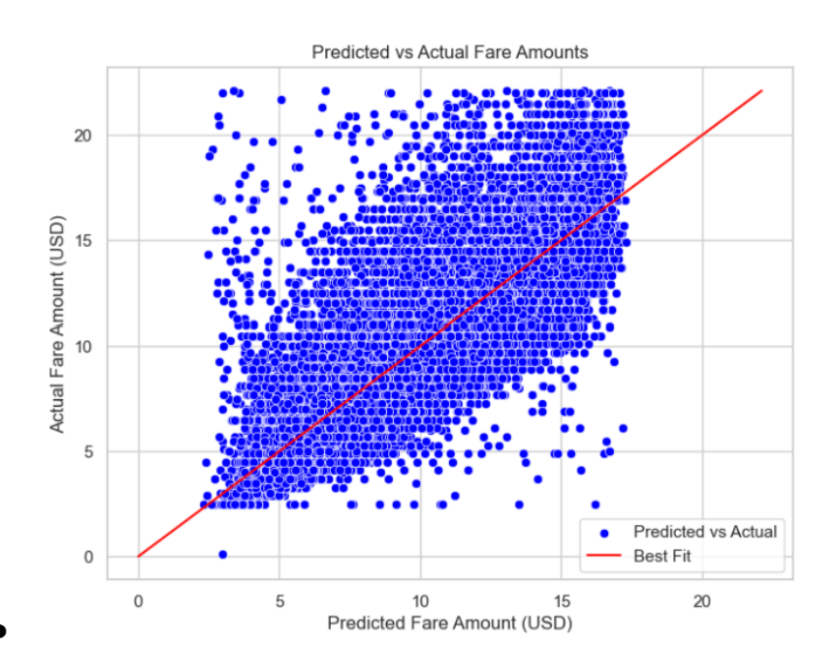

# Machine Learning Project: Uber Fare Price Predictor
## Team: Ari Nair, Leo Alexeyev, Suhas Kumar, Sanjay Vijayasekar, Adil Shaik

# Introduction/Background:

With the rise of digital taxi services like Uber and Lyft, interest in analyzing the digital taxi industry has surged, especially in urban areas. As cities expand, transportation becomes more complex due to factors such as congestion and population growth, making it critical to understand elements affecting fare and trip duration. By analyzing the data surrounding the digital taxi industry, predictive models can be developed for factors like fare amounts. 

Studies such as Zhen et al. (2017) focused on predicting taxi demand in NYC using spatial-temporal features [1]. Wang et al. (2019) developed a machine learning model to predict ride-sharing demand and trip duration based on time, location, and traffic conditions [2]. These models underscore the importance of machine learning in understanding and predicting taxi service metrics like fare and time, offering valuable insights for users and businesses alike.

# Dataset Description:

The dataset used provides extensive data on taxi trips, with key fields including:

- `key`: unique identifier for each trip
- `fare_amount`: trip cost in USD
- `pickup_datetime`: trip start time and date
- `passenger_count`: number of passengers
- `pickup_longitude`, `pickup_latitude`: coordinates of trip start
- `dropoff_longitude`, `dropoff_latitude`: coordinates of trip end

The dataset is available here: [Dataset Link](https://www.kaggle.com/datasets/yasserh/uber-fares-dataset).

# Problem Definition:

Uber offers rideshare services as an alternative to traditional taxis, connecting passengers to drivers via mobile apps. The base fare of an Uber ride depends on factors like pickup location, time, and passenger count. However, passengers often don’t know the cost of the ride until booking. This lack of information can prevent users from adjusting their pickup location or time to get a lower fare.

Our goal is to address this issue by creating a machine learning model that predicts the cost of an Uber ride based on specific variables. This would help Uber’s user base of over 7.4 million plan cost-effective rides, making it easier for passengers to fit trips into their budgets and schedules [3].

# Methods:

Our approach includes preprocessing techniques like data cleaning, feature engineering, and data sampling. Data cleaning ensures the removal of duplicates or incomplete entries, while feature engineering adds new features, such as day of the week and distance between pickup and dropoff. Data sampling reduces the size of the dataset, making model training more efficient.

## Linear Regression (Supervised Learning):

**Overview**

We completed implementing a linear regression model that would take in the features and attempt to graph a linear relationship which predicts the price given the variable states. We considered various items as variables but we centered around core features like distance to destination, the number of passengers, as well as the hours/time of day, and the days of the week. We were hoping to notice any specific relationships between these features to construct a prediction for the fare price. Possible notions like “rush hour” or busier days of the week for coming to the office or staying home, as well as the number of people involved, were hoped to be noticed.

**Data Preprocessing**

The dataset initially consisted of 200,000 elements, each containing information about the fare amount, number of passengers, pickup time, and pickup/dropoff locations. There was one element that contained null data for the dropoff locations, so we omitted that element from our model. We decided to use the day of the week and hour of the day as features for our model, since Uber changes its prices depending on the number of requests at a certain time. These columns were extracted based on data in the pickup time column. We also used the distance traveled as a feature for the model, and this was computed via the Haversine function [4] since the pickup and dropoff locations were given via longitude and latitude. After creating columns for our necessary features, we removed unneeded columns, specifically those titled `Unnamed: 0`, `key`, and `pickup_datetime`. Below, you can see an example of the first five elements before and after feature engineering.

Following feature engineering, we examined each feature for outliers using the standard outlier formula (> 1.5 * IQR + Q3 or < Q1 - 1.5 * IQR). We can visualize these quartiles via a box plot for the features below (distance plotted in km).

In addition to outliers found through the formula, the visualization helped identify certain errors, such as negative fares and distances, as well as passenger counts of zeros. It was important to perform data cleaning on outliers to preserve model accuracy, since linear regression works by calculating squared residuals. This way, we prevent outlier features, especially ones that are clearly a dataset error (e.g., 200+ passengers, which is unfeasible), from having a high impact on the predictions by the model. After removing these outliers, we were left with 149,905 elements, creating the following box plot features:

Additionally, we created stacked histograms to describe the relationship between fare amount and frequency of day of the week, hour of day, and passenger count. We used a scatter plot to show distance and fare amount, since that is a continuous distribution. We can examine the following plots before and after data cleaning, noting that the distribution was much more uniform post-cleaning, ensuring model stability.

Addionaly, we plan to implement:
  
- **Random Forest (Supervised Learning):** By generating trees that learn from fare data, averaging them provides a more accurate prediction.

- **Gaussian Mixture Model (Unsupervised Learning):** This method groups trips into components representing different patterns, such as rush hour, predicting fare based on cluster averages.

# Results and Discussion:

## Linear Regression

**Results**
Most of the results were expected, but we struggled to find some concrete relationships as much of the details were similar. The lack of data points in various categories led to some concern as we weren’t able to deduce much from them. However, a lack of data points may also simply indicate how popular that item/region was and so we were able to make some deductions. In terms of the model, we were able to achieve an R-squared value of around 0.65 as shown in the pictures at the bottom. This would mean that around 65% of the variance in the data is explained by our model. Ideally it would be better to have more variance in our data explained by our model, but we thought that this was a good starting point, especially after some substantial refactoring and tweaking of the model. We hope to improve the value by the final presentation. In terms of the mean absolute error, we achieved a value of roughly 1.574. We decided to compare this metric with the mean absolute error from if we had simply guessed the average each time which was 2.956. This difference is a positive metric for us as we were able to at least get relatively more “accurate” results seeing that we perform considerably better than if we had simply just guessed the average. Once again, there is a lot of room for improvement, but we hope to do that by the end of the project. The same goes for the RMSE, which is 2.209 for our model and 3.366 and simply by guessing the average. The same reason applies here as well. You can also see our plot below of the predicted and actual mapping on the same graph. All in all, we have some considerable progress but there is still quite some room for improvement. Due to the large influx/amount of fare prices that are common, we can perform somewhat accurately on them. However, due to the lack of data for higher price fares, we are left with less accurate/uncertain predictions or model incorporation. In terms of noticeable trends, much of the features were for the most part even, in terms of time of day, or day of the week. Single passengers seem to be the most common, which is mostly expected. Somewhere around 5 to 6 dollars on the fare price seems to be the most common, without much difference in day of the week or time of day. Looking to the future, we hope to improve and optimize our model as well as continue experimenting with augmenting our data to achieve better results. This is laid out in more detail in our next steps

**Next Steps**

There are various features, optimizations, and data enhancements that can improve the accuracy of our model's predictions. For the future, there are key areas to focus on:

1. **Feature Engineering**: We can add important temporal elements, such as holidays, long weekends, or seasonal activities that might cause fare prices to spike. Incorporating this temporal information can help the model make more accurate predictions.

2. **Optimizing the Model**: A future enhancement is to expand our current model by incorporating higher-degree polynomial features. This would allow the model to understand non-linear relationships within the features, potentially improving accuracy without overly complicating the model.

3. **Data Filtering**: Although we've cleaned the data to remove most outliers and irregular data, some illogical data points may still exist. Using clustering to identify and group unusual patterns could further enhance prediction accuracy.

4. **Improving Measured Metrics**: Adding confidence intervals to the model's predictions would allow it to indicate its confidence in a given fare estimate. This could be a helpful feature for customers seeking a more transparent evaluation.
For more details on regression metrics, visit:

5. **Updating Data with Respect to the Uber Environment**: Since Uber’s payment structure and policies can change, we could add a feedback loop to retrain the model periodically. This would help the model adapt to any drastic changes in Uber's pricing structure.

# Responsibilities

 - [Gaant Chart](https://1drv.ms/x/s!AomHvZlF9no2jvgV5C5gnQ3g6QnusA?e=zDxLAn)

**Contribution Table**

| Name           | Proposal Contributions        |
|----------------|-------------------------------|
| Leo            | Created write-up and visualizations for data preprocessing and cleaning, udpated github pages        |
| Ari            | Implemented data processing and linear regression in a jupyter notebook, helped create visualizations in notebook |
| Adil           | Created write-up and visualizations for results |
| Suhas          | Wrote next steps and analysis        |
| Sanjay         | Created visualizations for data and results  |

## References

[1] Zhen, L., Wang, S., Zhang, D., & Zhan, X. (2017). Predicting Taxi Demand in New York City Using Spatial-Temporal Features. *IEEE Access*, 5, 6075-6086.

[2] Wang, D., Pedreschi, D., Giannotti, F., & Gao, J. (2019). Predicting Ride-Sharing Demand and Trip Duration. *Proceedings of the ACM on Interactive, Mobile, Wearable and Ubiquitous Technologies*, 3(3), 1-22.

[3] Uber. (2024). Uber Investor Home. Retrieved from https://investor.uber.com/home/default.aspx

[4] IGISMAP. (n.d.). Haversine Formula – Calculate geographic distance on earth. Retrieved from https://www.igismap.com/haversine-formula-calculate-geographic-distance-earth/