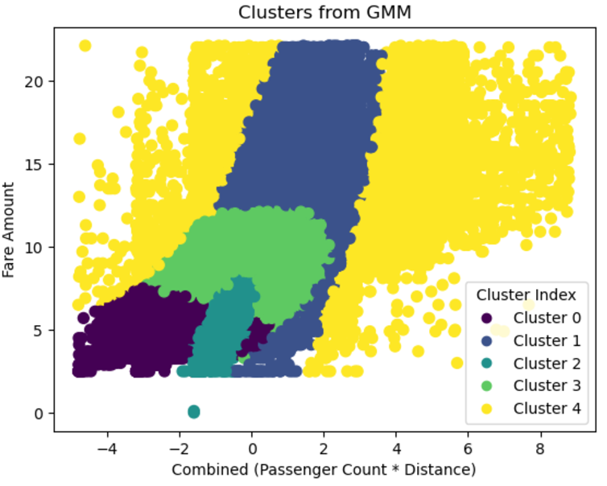
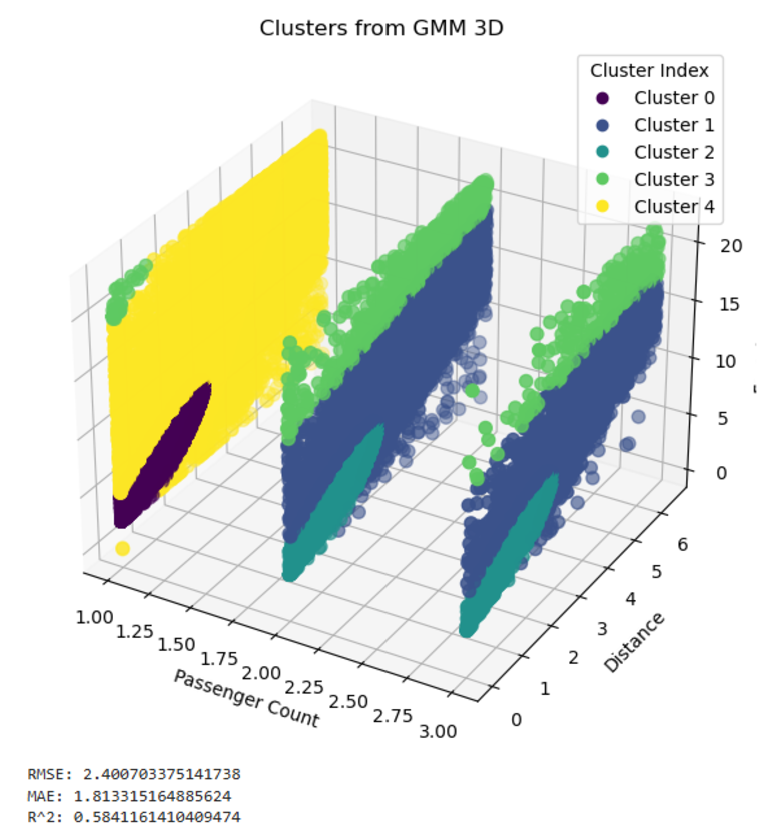
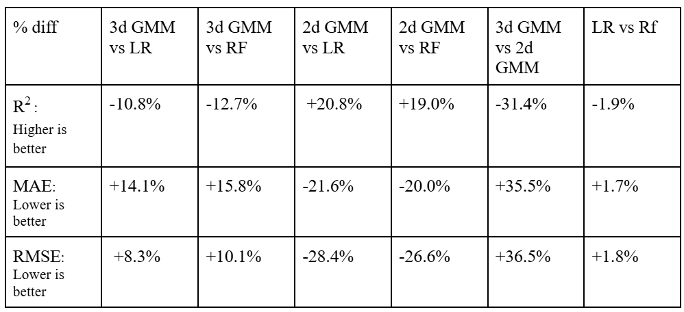

# Introduction/Background:

With the rise of digital taxi services like Uber and Lyft, interest in analyzing the digital taxi industry has surged, especially in urban areas. As cities expand, transportation becomes more complex due to factors such as congestion and population growth, making it critical to understand elements affecting fare and trip duration. By analyzing the data surrounding the digital taxi industry, predictive models can be developed for factors like fare amounts. 

Studies such as Zhen et al. (2017) focused on predicting taxi demand in NYC using spatial-temporal features [1]. Wang et al. (2019) developed a machine learning model to predict ride-sharing demand and trip duration based on time, location, and traffic conditions [2]. These models underscore the importance of machine learning in understanding and predicting taxi service metrics like fare and time, offering valuable insights for users and businesses alike.

# Dataset Description:

The dataset used provides extensive data on taxi trips, with key fields including:

- `key`: unique identifier for each trip
- `fare_amount`: trip cost in USD
- `pickup_datetime`: trip start time and date
- `passenger_count`: number of passengers
- `pickup_longitude`, `pickup_latitude`: coordinates of trip start
- `dropoff_longitude`, `dropoff_latitude`: coordinates of trip end

The dataset is available here: [Dataset Link](https://www.kaggle.com/datasets/yasserh/uber-fares-dataset).

# Problem Definition:

Uber offers rideshare services as an alternative to traditional taxis, connecting passengers to drivers via mobile apps. The base fare of an Uber ride depends on factors like pickup location, time, and passenger count. However, passengers often don’t know the cost of the ride until booking. This lack of information can prevent users from adjusting their pickup location or time to get a lower fare.

Our goal is to address this issue by creating a machine learning model that predicts the cost of an Uber ride based on specific variables. This would help Uber’s user base of over 7.4 million plan cost-effective rides, making it easier for passengers to fit trips into their budgets and schedules [3].

# Overview

We implemented a linear regression model, a random forest model, and a gaussian mixture model (GMM) that would take in the features and attempt to predict the price given the variable states. We considered various items as variables but we centered around core features like, distance to destination, the number of passengers, as well as the hours/time of day, and the days of the week. We were hoping to notice any specific relationships between these features to construct a prediction for the fare price. Possible notions like “rush hour” or busier days of week for coming to office or staying home, as well as the number of people involved were hoped to be noticed.

# Data Preprocessing:

Our approach includes preprocessing techniques like data cleaning, feature engineering, and data transformation. Data cleaning ensures the removal of duplicates or incomplete entries, while feature engineering adds new features, such as day of the week and distance between pickup and dropoff. We also use data transformation to standardize all numerical data to have a mean of 0 and a normal distribution.

The dataset initially consisted of 200,000 elements, each containing information about the fare amount, number of passengers, pickup time, and pickup/dropoff locations. There was one element that contained null data for the dropoff locations, so we omitted that element from our model. We decided to use the day of the week and hour of the day as features for our model, since Uber changes its prices depending on the number of requests at a certain time. These columns were extracted based on data in the pickup time column. We also used the distance traveled as a feature for the model, and this was computed via the Haversine function [4] since the pickup and dropoff locations were given via longitude and latitude. After creating columns for our necessary features, we removed unneeded columns, specifically those titled `Unnamed: 0`, `key`, and `pickup_datetime`. Below, you can see an example of the first five elements before and after feature engineering.

Following feature engineering, we examined each feature for outliers using the standard outlier formula (> 1.5 * IQR + Q3 or < Q1 - 1.5 * IQR). We can visualize these quartiles via a box plot for the features below (distance plotted in km).

In addition to outliers found through the formula, the visualization helped identify certain errors, such as negative fares and distances, as well as passenger counts of zeros. It was important to perform data cleaning on outliers to preserve model accuracy, since linear regression works by calculating squared residuals. This way, we prevent outlier features, especially ones that are clearly a dataset error (e.g., 200+ passengers, which is unfeasible), from having a high impact on the predictions by the model. After removing these outliers, we were left with 149,905 elements, creating the following box plot features:

Additionally, we created stacked histograms to describe the relationship between fare amount and frequency of day of the week, hour of day, and passenger count. We used a scatter plot to show distance and fare amount, since that is a continuous distribution. We can examine the following plots before and after data cleaning, noting that the distribution was much more uniform post-cleaning, ensuring model stability.

We experimented with using SMOTE and resampling to address data imbalances. This was done by creating bins for the fare amounts and adding a column classifying each point into one of these bins. Then, SMOTE and resampling was used to create synthetic data points so that the number of data points in each of the fare amount bins is the same. Typically, addressing data imbalances is important as it reduces the chance of the model being biased towards certain bins. However, after implementing these techniques, we saw our metrics (MAE and RMSE) increase, indicating that these data imbalance processing methods were not beneficial for our data, so it was not included in the final models.

Finally, upon fitting the model on our data, we implemented data transformation by scaling all numerical feature data to have a mean of 0 and a normal distribution. This works by using the mean and standard deviation of each feature to determine the z-score of each data point. This is beneficial for training as it makes it easier for models to understand differences in numerical data, which is especially useful for features such as distance, which has a large range. It also helps models converge quicker as each feature’s range will be much more similar.

# Model Results and Discussion:

## Linear Regression (Supervised Learning):

Most of the results were expected, but we struggled to find some concrete relationships as much of the details were similar. The lack of data points in various categories led to some concern as we weren’t able to deduce much from them. However, a lack of data points may also simply indicate how popular that item/region was and so we were able to make some deductions.

In terms of the model, we were able to achieve an R-squared value of around 0.65 as shown in the pictures at the bottom. This would mean that around 65% of the variance in the data is explained by our model. Ideally it would be better to have more variance in our data explained by our model, but we thought that this was a good starting point, especially after some substantial refactoring and tweaking of the model.

In terms of the mean absolute error, we achieved a value of roughly 1.574. We decided to compare this metric with the mean absolute error from if we had simply guessed the average each time which was 2.956. This difference is a positive metric for us as we were able to at least get relatively more “accurate” results seeing that we perform considerably better than if we had simply just guessed the average.

The same goes for the RMSE, which is 2.209 for our model and 3.366 and simply by guessing the average. The same reason applies here as well. You can also see our plot below of the predicted and actual mapping on the same graph.

All in all, we have some considerable progress but there is still quite some room for improvement. Due to the large influx/amount of fare prices that are common, we can perform somewhat accurately on them. However, due to the lack of data for higher price fares, we are left with less accurate/uncertain predictions or model incorporation. In terms of noticeable trends, much of the features were for the most part even, in terms of time of day, or day of the week. Single passengers seem to be the most common, which is mostly expected. Somewhere around 5 to 6 dollars on the fare price seems to be the most common, without much difference in day of the week or time of day. Looking to the future, we hope to improve and optimize our model as well as continue experimenting with augmenting our data to achieve better results.

## Random Forest (Supervised Learning):

Overall, we found most of the results from the random forest model to be consistent with what we expected. However, due to similarities in features from our dataset, we found weaker relationships than we anticipated. To evaluate model performance, we examined R^2, mean absolute error (MAE), and root mean squared error (RMSE) values. We used these values to compare our model performance with baseline (predicting the mean of target variable) performance.

Our model achieved an R^2 value of around 0.663, versus a baseline value of around -0.00006. This means that our random forest model can explain around 66.3% of the variance in the model, and the comparison with the naive approach shows our model performs far better. Although this value is not particularly high, values above 0.5 are typically described as acceptable to be statistically significant.

For MAE, our random forest model achieved a value of 1.547, versus a baseline value of around 2.956. MAE describes the average prediction error, meaning our model has a substantial improvement over the baseline when it comes to predicting fare price. Therefore, our model is much more precise than the baseline.

Similarly, we saw improvement in our model for RMSE values. The random forest model achieved a value of around 2.169, compared to the baseline value of around 3.737. The larger the error in RMSE, the higher the penalty, meaning our model has significantly smaller deviations in predictions compared to the baseline approach. This likely means our model handles both common and less frequent fare prices.

We can create some visualizations to help explain our data. Starting with a scatterplot depicting actual vs. predicted values, we see that we have a pretty large spread among our values, however they overall follow the x = y best fit line, implying a correlation between the two variables.

To continue, we plotted a histogram of the residuals, to visualize the prediction errors of the model. Our plot showed a symmetric, bell-shaped distribution centered at zero, implying that our model is an unbiased good fit.

In order to figure out which features had the greatest impact on selection within our random forest, we plotted the relative feature importance as a bar graph normalized to add up to 1. The score represents how much each feature contributes to reducing the error, and in our model distance was by far the most important feature. This tells us that the model heavily relies on distance to predict the fare price, and not nearly as much on the other variables.

Finally, we plotted the training and validation MSE error as the training set size increased. We can see that as the number of training sets increases, our training and validation errors begin to converge towards one another, implying that our model is neither overfitting nor underfitting. Although we have a gap of around 0.4 towards the end of our conversion, this is comparatively a very small gap and reflects slight noise/variation in the data. Overall, this implies the dataset has variance, however the model is generalizing well to unseen data.

Although our model performed well, there are still avenues for further optimization. In order to improve model performance for less common price fares, we hope to incorporate additional real-world data or use data generating techniques to add synthetic data. Overall, the random forest model provides a significant contribution to predicting Uber fare prices, providing both improved accuracy and insights into the dataset.

## Gaussian Mixture Model (Unsupervised Learning):

After applying Gaussian Mixture Models to cluster and predict Uber fares using different feature combinations from the dataset, we evaluated three 2D models and one 3D model after data cleaning. The 2D models used feature combinations of sum_x (passenger count + distance), weighted_sum_x (weighted passenger count and distance), and mult_x (passenger count × distance). Each model was compared using Mean Absolute Error (MAE), Root Mean Squared Error (RMSE), and R^2 scores. In the 2D models, the mult_x combination achieved the best results with the lowest RMSE of 1.66, indicating the best predictive accuracy, though its R^2 score of 0.80 was slightly lower than that of the sum_x model, which achieved 0.87. 

The sum_x model explained the most variance in fare predictions but at the cost of significantly higher RMSE (2.47), showing less reliability for accurate predictions. The weighted_sum_x model balanced the features but did not do so well with an RMSE of 2.95 and the lowest R^2 of 0.68.

The 3D model, which used passenger count, distance, and fare amount, provided insights into feature interactions. However, it had a higher RMSE of 2.40 and a lower R^2 of 0.58 compared to the 2D models. The nature of passenger count created slices in the clusters, negatively impacting the model's performance. Despite its limitations, the 3D model allowed for broader clustering perspectives, although it lacked the precision of the mult_x 2D model.

In conclusion, the mult_x model is recommended for fare predictions due to its balance of simple computations and predictive accuracy. While the sum_x model best captures underlying trends with its higher R^2, its lack of precision makes it less ideal for fare prediction tasks. The 3D model, while valuable for understanding feature relationships, is less practical for accurate predictions. Future improvements could involve exploring feature transformations, increasing dataset size, and validating these models on larger datasets.

## Comparsion:

**Linear Regression vs. Random Forest**

As Linear Regression and Random Forest Regression are both regression models, it is straightforward to compare the effectiveness of the two models. As such performance metrics can be used to directly compare the performance of the two models. Looking at the performance metrics, the two models perform very similarly, however Random Forest does slightly outperform Linear Regression in all 3 metrics.

Looking at the Coefficient of Determination (R2), Linear Regression has a value of 0.651 and Random Forest has a value of 0.663. This means that Random Forest explains 66.3% of the variance in the data compared to 65.1% for Linear Regression. A higher value is better as it is more desirable for the model to explain a higher percentage of the variance in the data. Based on the results, Random Forest was able to explain a larger amount of the variance in the data than Linear Regression and as such Random Forest slightly outperforms Linear regression when it comes to R2.

Mean Absolute Error (MAE) and Root Mean Squared Error (RMSE) are both similar metrics. They measure how far the predicted results produced by the model differ from the actual values. Linear Regression has an MAE of 1.574 and a RMSE of 2.209. Random Forest has a MAE of 1.547 and a RMSE of 2.169. For both metrics, a lower value is more desirable as it means that the model produces outputs closer to the actual value. As such, Random Forest slightly outperforms linear regression in both of these metrics.

The differences in performance can be quantified using percent differences. Using percent difference, Random Forest outperforms Linear regression by 1.9% when it comes to R2, 1.7% when it comes to MAE, and 1.8% for RMSE. While Random Forest does outperform Linear Regression in all metrics, the differences are quite small. This means that models are quite similar in effectiveness. In addition, doing things to optimize the models such as improving data processing, adding more data, and feature engineering, could produce results where linear regression outperforms Random Forest. To conclude, Linear Regression and Random Forest regression both perform quite similarly, but Random Forest does perform slightly better.

**GMM vs. Linear Regression and Random Forest**

Since Guassian Mixture Models are unsupervised models that are generally used for classification, they cannot be directly compared the way Linear Regression and Random Forest can be. However, this issue can be solved by using the center of each cluster as our prediction for that point. This makes it possible to get a set of predictions that can be used to calculate performance metrics such as R2, MAE, and RMSE.
	
The 3d implementation of GMM used passenger count and distance as independent variables. This was able to achieve an R2 of 0.594, MAE of 1.813, and RMSE of 2.401. These results are less desirable than those produced by the previous regression models. 

However, a 2d implementation of GMM that used a multiplication of passenger count and distance as the independent variable, was able to provide very desirable results. It was able to achieve an R2 of 0.802, MAE of 1.266, and RMSE of 1.66. This produces a very desirable outcome and outperforms both regression models.

# Next Steps

There are various features, optimizations, and data enhancements that can improve the accuracy of our model's predictions. For the future, there are key areas to focus on:

1. **Feature Engineering**: We can add key elements such as specific temporal trends, such as holidays, long weekends, or some seasonal activity that could cause fare prices to spike. Our model could take this temporal information into account when predicting fare prices. We could also use the original inputs of longitude and latitude to determine the city the Uber ride was in, which could be 1 hot encoded to be used as a new feature.

2. **Optimizing the Model**: Another future step is to expand our linear regression model to incorporate higher degree polynomial features, meaning our model can try to understand non linear characteristics in the features, leading the model to predict more accurately while actively not making our model too much more complicated. For our random forest model, we can use bayesian hyperparameter tuning to help improve generalization and mitigate model overfitting.

3. **Data Filtering**: Though the data is cleaned to remove most outliers and irregular data, there are occurrences of data points that are illogical. Our model could incorporate clustering to try to group unusual patterns and improve predicting accuracy.

4. **Improving Measured Metrics**: Adding confidence intervals to the model's predictions would allow it to indicate its confidence in a given fare estimate. This could be a helpful feature for customers seeking a more transparent evaluation.

5. **Updating Data with Respect to the Uber Environment**: Since Uber’s payment structure and policies can change, we could add a feedback loop to retrain the model periodically. This would help the model adapt to any drastic changes in Uber's pricing structure.

These next steps are to guide the model to increase the R-squared value while also aiming to decrease MAE and RMSE, improving model accuracy.

# Responsibilities

 - [Gaant Chart](https://1drv.ms/x/s!AomHvZlF9no2jvgV5C5gnQ3g6QnusA?e=zDxLAn)

**Contribution Table**

| Name           | Proposal Contributions        |
|----------------|-------------------------------|
| Leo            | Implemented random forest model for our dataset, created visualizations in jupyter notebook, did write-up of random forest results, udpated github pages |
| Ari            | Implemented data preprocessing and methods (data cleaning, transformation, engineering), experimented with data imbalance method. Implement linear regression method, Created and recorded presentation/video |
| Adil           | Implemented GMM model for our dataset for various 2D and 3D implementations, created visualiations for results |
| Suhas          | Created write-up for GMM model results and discussion |
| Sanjay         | Analyed and created write-up comparing models to one another, created table summarizing results |

## References

[1] Zhen, L., Wang, S., Zhang, D., & Zhan, X. (2017). Predicting Taxi Demand in New York City Using Spatial-Temporal Features. *IEEE Access*, 5, 6075-6086.

[2] Wang, D., Pedreschi, D., Giannotti, F., & Gao, J. (2019). Predicting Ride-Sharing Demand and Trip Duration. *Proceedings of the ACM on Interactive, Mobile, Wearable and Ubiquitous Technologies*, 3(3), 1-22.

[3] Uber. (2024). Uber Investor Home. Retrieved from https://investor.uber.com/home/default.aspx

[4] IGISMAP. (n.d.). Haversine Formula – Calculate geographic distance on earth. Retrieved from https://www.igismap.com/haversine-formula-calculate-geographic-distance-earth/